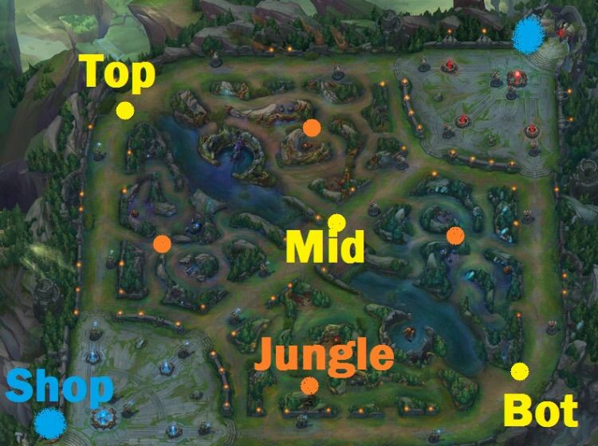
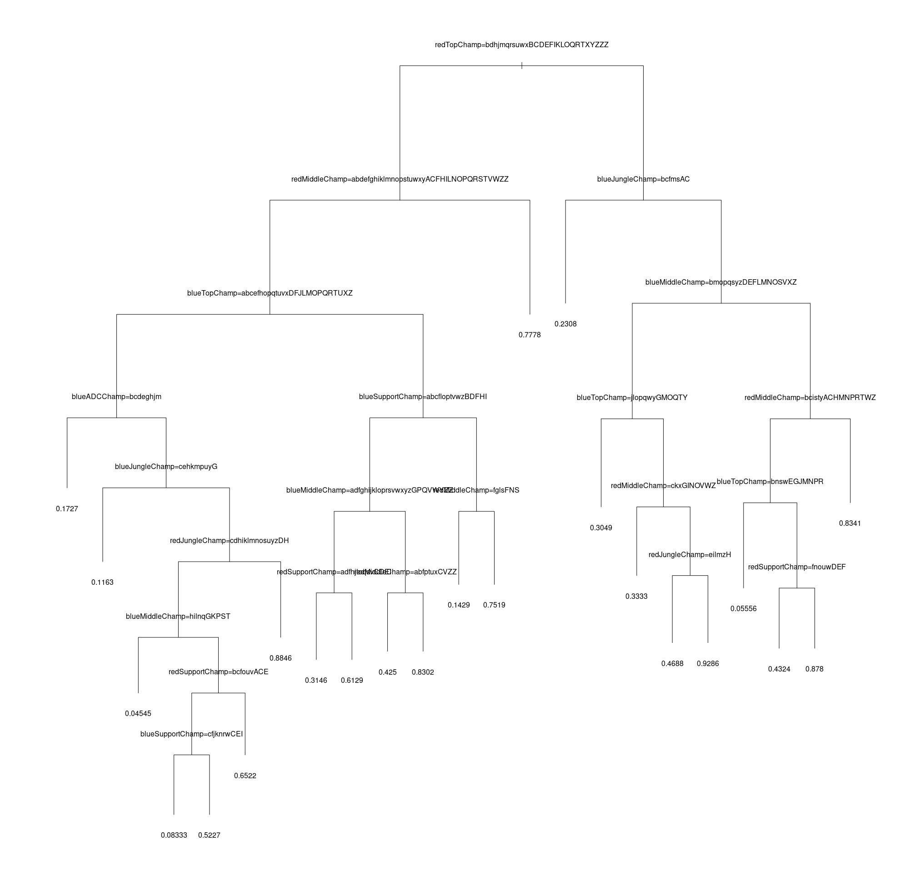
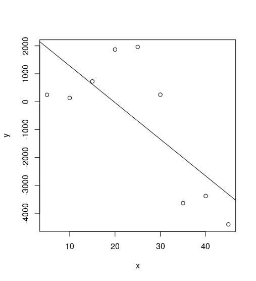

# leak-of-legends
A project for the Applied Statistics university course at Sofia University: An analysis of data from League of Legends games.


## Is it any good?
Most probably, no.


## Short description of League of Legends

There are two teams: blue and red, which have their bases at the bottom left and upper right corners accordingly. Each team consists of 5 player, playing 5 unique (in the team) champions and strives to destroy the base of the enemy. Before being able to go to the enemy base the team has to destroy the defense towers placed on the enemy side of the terrain. Periodically, the base of each team summons a wave of minions, which move toward the enemy base on each of the three lanes and mindlessly attack every enemy unit on their way.




There's an unwritten rule or tactic, which virtually all teams play by: there is an Attack Damage carry (ranged fighter, which inflicts physical damage) and a healer on the bottom lane, a mage on the middle lane, one champion on the top lane and one inside the jungle (who every now and then will attempt surprise attacks on the lanes).


## Statistical analysis


### Problem #1: is it possible to predict (with at least some degree of accuracy) the outcome of the game only by the champions selected for each role in the two teams.

The expected result is that we shouldn't be able to do such prediction (at least not with high degree of accuracy), because otherwise it will mean that the game is really imbalanced and favors some champions over others. On the other hand, it is true that some champions are good counters of others and hence, it may turn out, that it is possible to devise a model which is little bit better than the random model (which obviously should has 50% success rate).


#### Creating a test set

Let's load the dataset:

```R
library(readr)
LeagueofLegends <- read_csv("LeagueofLegends.csv")
View(LeagueofLegends)
```


We take only the picked champions and the result of the game.

```R
picks_and_result <- LeagueofLegends[, c(6, 11, 13, 15, 17, 19, 21, 23, 25, 27, 28)]
```


```R
> picks_and_result
# A tibble: 3,645 × 11
   bResult blueTopChamp blueJungleChamp blueMiddleChamp blueADCChamp blueSupportChamp redTopChamp redJungleChamp redMiddleChamp redADCChamp redSupportChamp
     <int>        <chr>           <chr>           <chr>        <chr>            <chr>       <chr>          <chr>          <chr>       <chr>           <chr>
1        1       Irelia          RekSai            Ahri         Jinx            Janna        Gnar          Elise           Fizz       Sivir          Thresh
2        0         Gnar          Rengar            Ahri      Caitlyn            Leona      Irelia       JarvanIV           Azir       Corki           Annie
3        1     Renekton          Rengar            Fizz        Sivir            Annie        Sion         LeeSin           Azir       Corki           Janna
4        0       Irelia        JarvanIV         Leblanc        Sivir           Thresh        Gnar           Nunu           Lulu      KogMaw           Janna
5        1         Gnar        JarvanIV       Lissandra     Tristana            Janna        Sion         RekSai           Lulu       Corki           Annie
6        0     Kassadin          Rengar         Leblanc        Sivir            Annie        Gnar       JarvanIV           Lulu       Corki          Thresh
7        1       Irelia        JarvanIV          Xerath        Corki            Janna    Renekton         LeeSin        Leblanc    Tristana            Nami
8        1     Renekton        JarvanIV            Azir      Caitlyn            Annie      Rumble         Rengar        Leblanc       Sivir      Blitzcrank
9        0         Sion          RekSai         Orianna       KogMaw            Janna    Kassadin             Vi            Zed       Corki         Morgana
10       1       Irelia        Nocturne         Orianna        Sivir             Nami        Gnar         Rengar        Leblanc      Graves         Morgana
# ... with 3,635 more rows
```


We seed the random generator:

```R
set.seed(42)
```


We pick random indexes for creating a training set:

```R
training_set_indexes <- sample(nrow(picks_and_result), 1500)
```


We then take the training subset from the whole dataset:

```R
training_set <- picks_and_result[training_set_indexes, ]
```


And create a test set with all rows which aren't part of the training set:

```R
test_set <- picks_and_result[-training_set_indexes, ]
```


Convert all predictor variables to factors:

```R
training_set$blueTopChamp <- as.factor(training_set$blueTopChamp)
training_set$blueJungleChamp <- as.factor(training_set$blueJungleChamp)
training_set$blueMiddleChamp <- as.factor(training_set$blueMiddleChamp)
training_set$blueADCChamp <- as.factor(training_set$blueADCChamp)
training_set$blueSupportChamp <- as.factor(training_set$blueSupportChamp)

training_set$redTopChamp <- as.factor(training_set$redTopChamp)
training_set$redJungleChamp <- as.factor(training_set$redJungleChamp)
training_set$redMiddleChamp <- as.factor(training_set$redMiddleChamp)
training_set$redADCChamp <- as.factor(training_set$redADCChamp)
training_set$redSupportChamp <- as.factor(training_set$redSupportChamp)
```


We train a decision tree:

```R
model <- rpart(bResult ~ ., data=training_set, method="class")
plot(model)
text(model)
```

(We have printed it without pretty print, since otherwise we get a list of many champion names for each branch and it's very cluttered and unreadable)




When we try to do a prediction on the test set, it turns out that there's a problem: 

```R
predict(model, test_set, type="class")
Error in model.frame.default(Terms, newdata, na.action = na.action, xlev = attr(object,  : 
  factor blueTopChamp has new levels Akali, Alistar, Diana, Kayle, Khazix, LeeSin, Lucian, Nocturne, Nunu, Rengar, Varus, Yorick, Zac
```


Since our dataset is really not big enough, it is normal that some of the Role/Champion pairs that are present in the test set didn't appear in the training set. Lets see how dire is the situation:


```R
length(test_set$blueTopChamp[!(test_set$blueTopChamp %in% training_set$blueTopChamp)])
[1] 22
```


The above piece of code tells us how many rows in the test set have champions for the "Top lane" role that were never played for that role in the training set. These rows cannot be predicted and we should remove them.  We want to see if there's too many such rows. The total number of such rows will be less or equal than the sum of all unknown role/champion pairs for each predictor. Lets check this out:


```R
count <- 0
for (predictor in names(test_set)[2:11]) {
  column <- get(predictor, test_set)
  unseen <- length(column[!(column %in% get(predictor, training_set))])
  count <- count + unseen
}
count
[1] 105
```


Less than 105 out of 2145, this seems okay. Lets remove these unpredictable cases from the test set. (Note that the more data we have the more this problem will disappear. Also, we can employ a more advanced algorithm for creating a training set, but let's keep it simple)


```R
indices <- list()
for (predictor in names(test_set)[2:11]) {
  new_indices <- which(!(get(predictor, test_set) %in% get(predictor, training_set)))
  indices <- append(indices, new_indices)
}
indices_to_remove <- unique(indices)
```


And the actual number of the rows which we'll remove is:

```R
length(indices_to_remove)
[1] 100
```


Take the predictable subset of the test set:

```R
predictable_test_set <- test_set[! 1:nrow(test_set) %in% indices_for_remove, ]
```


We run the test set through the model and get our predictions:

```R
predictions <- predict(model, predictable_test_set, method="class")
```

```R
head(predictions)
          0         1
1 0.6600000 0.3400000
2 0.1659389 0.8340611
3 0.3333333 0.6666667
4 0.6951220 0.3048780
5 0.1659389 0.8340611
6 0.6600000 0.3400000
```


We will normalize the results by taking only the second column and if the probability is greater or equal to 0.5, then the prediction is 1, else it's 0.

```R
normalized_predictions <- ifelse(predictions[, 2] >= 0.5, 1, 0)
```


And finally, we test how accurate is our model:

```R
summary(predictable_test_set$bResult == normalized_predictions)
   Mode   FALSE    TRUE    NA's 
logical     977    1068       0 
```


And that's **52.22%** success rate, which corresponds to our preliminary expectations. This results indicates that the it is hard/impossible to give good predictions of the game outcome by knowing only the champions that were selected by the two teams. Which is a positive result since it means that the powers of the champions in the game are not too unbalanced.


### Problem #2: Predict the outcome of the game after N minutes of the game has already passed

We load the datasets:

```R
library(readr)
goldValues <- read_csv("goldValues.csv")
View(goldValues)
```

and also

```R
deathValues <- read_csv("deathValues.csv")
View(deathValues)
```


```R
head(goldValues)
# A tibble: 6 × 83
                                                                                        MatchHistory NameType min_1 min_2 min_3 min_4 min_5 min_6 min_7 min_8
                                                                                               <chr>    <chr> <int> <int> <int> <int> <int> <int> <int> <int>
1 http://matchhistory.na.leagueoflegends.com/en/#match-details/TRLH1/30030?gameHash=fbb300951ad8327c golddiff     0     0   -14   -65  -268  -431  -488  -789
2 http://matchhistory.na.leagueoflegends.com/en/#match-details/TRLH1/30054?gameHash=055b17da8456fdc8 golddiff     0     0   -26   -18   147   237  -152    18
3 http://matchhistory.na.leagueoflegends.com/en/#match-details/TRLH1/30067?gameHash=8e8a9b58df366e2d golddiff     0     0    10   -60    34    37   589  1064
4 http://matchhistory.na.leagueoflegends.com/en/#match-details/TRLH1/30091?gameHash=0ed1cd0e0e57329c golddiff     0     0   -15    25   228    -6  -243   175
5 http://matchhistory.na.leagueoflegends.com/en/#match-details/TRLH1/30105?gameHash=f932becf86175f38 golddiff    40    40    44   -36   113   158  -121  -191
6 http://matchhistory.na.leagueoflegends.com/en/#match-details/TRLH1/30131?gameHash=194c672d7969984f golddiff     0     0    20   -42   -48   -24  -219  -272
# ... with 73 more variables: min_9 <int>, min_10 <int>, min_11 <int>, min_12 <int>, min_13 <int>, min_14 <int>, min_15 <int>, min_16 <int>, min_17 <int>,
#   min_18 <int>, min_19 <int>, min_20 <int>, min_21 <int>, min_22 <int>, min_23 <int>, min_24 <int>, min_25 <int>, min_26 <int>, min_27 <int>, min_28 <int>,
#   min_29 <int>, min_30 <int>, min_31 <int>, min_32 <int>, min_33 <int>, min_34 <int>, min_35 <int>, min_36 <int>, min_37 <int>, min_38 <int>, min_39 <int>,
#   min_40 <int>, min_41 <int>, min_42 <int>, min_43 <int>, min_44 <int>, min_45 <int>, min_46 <int>, min_47 <int>, min_48 <int>, min_49 <int>, min_50 <int>,
#   min_51 <int>, min_52 <int>, min_53 <int>, min_54 <int>, min_55 <int>, min_56 <int>, min_57 <int>, min_58 <int>, min_59 <int>, min_60 <int>, min_61 <int>,
#   min_62 <int>, min_63 <int>, min_64 <int>, min_65 <int>, min_66 <int>, min_67 <int>, min_68 <int>, min_69 <chr>, min_70 <chr>, min_71 <chr>, min_72 <chr>,
#   min_73 <chr>, min_74 <chr>, min_75 <chr>, min_76 <chr>, min_77 <chr>, min_78 <chr>, min_79 <chr>, min_80 <chr>, min_81 <chr>
```


Our dataset has data for 3645 games, yet the goldValues set has 47385 rows.

```R
unique(goldValues$NameType)
 [1] "golddiff"        "goldblue"        "goldred"         "goldblueTop"     "goldblueJungle"  "goldblueMiddle"  "goldblueADC"     "goldblueSupport"
 [9] "goldredTop"      "goldredJungle"   "goldredMiddle"   "goldredADC"      "goldredSupport" 
```


In order to keep it simpler, we will take only the `golddiff` rows from this set. So, effectively, what we have in each row is the difference between the amounts of gold accumulated by the two teams until each minute. The difference is from the point of view of the Blue team. Let's take the first row to exemplify that:

| MatchHistory                             | NameType | min_1 | min_2 | min_3 | min_4 | min_5 |
| ---------------------------------------- | -------- | ----- | ----- | ----- | ----- | ----- |
| http://matchhistory.na.leagueoflegends.com/en/#match-details/TRLH1/30030?gameHash=fbb300951ad8327c | golddiff | 0     | 0     | -14   | -65   | -268  |


The interpretation of the above data is as follows: for the first two minutes of the game, the two teams have had the same amount of gold (minions and creatures are spawned after around two minutes of the game start, hence nobody acquired any gold). Then by the third minute the red team had 14 gold more and by the 5th they had 268 gold more, etc.


```R
goldDiffs <- goldValues[goldValues$NameType == "golddiff", ]
```


We will add the `bResult` column from `LeagueofLegends` to `goldDiffs`:

```R
goldDiffs$bResult = LeagueofLegends$bResult
```


We pick random indexes for creating a training set:

```R
training_set_indexes <- sample(nrow(goldDiffs), 1500)
```


We then take the training subset from the whole dataset:

```R
training_set <- goldDiffs[training_set_indexes, ]
```


And create a test set with all rows which aren't part of the training set:

```R
test_set <- goldDiffs[-training_set_indexes, ]
```


We will take only the values per 5 minutes:

```R
training_set_per_5 <- training_set[, c("MatchHistory", "bResult", "min_5", "min_10", "min_15", "min_20", "min_25", "min_30", "min_35", "min_40", "min_45")]
```

```R
test_set_per_5 <- test_set[, c("MatchHistory", "bResult", "min_5", "min_10", "min_15", "min_20", "min_25", "min_30", "min_35", "min_40", "min_45")]
```


For each match, we have a set of points (with the minute - 5, 10, 15... - on the X axis and the gold difference on the Y axis):




We will create a function which takes a set with the form of the above two sets and a minute (5, 10, 15, ..., 45) and which returns the coefficients of lines that are fitted through the gold differences of each match. 

```R
fit_lines <- function(set, minute) {
  fitted_lines <- data.frame()
  for (i in 1:nrow(set)) {
    row <- set[i, ]
    data <- data.frame(x = seq(1, minute, 5), y = as.numeric(as.vector(row[, 3:(2+minute/5)])))
    model <- lm(y ~ x, data = data)
  	new_row <- merge(row[, c("MatchHistory", "bResult")], data.frame(model$coefficients[1], model$coefficients[2]))
    fitted_lines <- rbind(fitted_lines, new_row)
  }
  colnames(fitted_lines) <- c("MatchHistory", "bResult", "intersect", "y")
  return(fitted_lines)
}
```


Example usage:

```R
head(fit_lines(training_set_per_5, minute=20))
                                                                                             MatchHistory bResult intersect       y
1     http://matchhistory.na.leagueoflegends.com/en/#match-details/TRKR1/920064?gameHash=59329523fdd4d423       1    -62.68   77.58
2     http://matchhistory.na.leagueoflegends.com/en/#match-details/TRKR1/600085?gameHash=be2d41460ace9b23       0   -151.90 -192.10
3 http://matchhistory.na.leagueoflegends.com/en/#match-details/TRLH3/1001220096?gameHash=898e47758375b6fb       0    351.28 -144.18
4      http://matchhistory.na.leagueoflegends.com/en/#match-details/TRTW/780077?gameHash=20f746e24dad2d21       0    380.60 -190.60
5 http://matchhistory.na.leagueoflegends.com/en/#match-details/TRLH3/1001010041?gameHash=25af3b79c61f6270       1  -1690.48  418.38
6 http://matchhistory.na.leagueoflegends.com/en/#match-details/TRLH1/1001760217?gameHash=4c0eef4bc6a24f18       0   -667.84 -543.96
```


Then we create a simple function that will generate a model from the intermediate dataset with fitted lines:

```R
create_lol_model <- function(training_set, minute) {
  fitted_lines <- fit_lines(training_set, minute)
  model <- glm(bResult ~ ., family = binomial(link = 'logit'), data = fitted_lines[, 2:4])
  return(model)
}
```


Let's create model for the 45th minute of the game:

```R
model <- create_lol_model(training_set_per_5, minute=45)
```


The test set must also be in the same format:

```R
test_set_fitted_lines <- fit_lines(test_set_per_5, minute=45)
```


Now we can try to predict the matches in the test set:

```R
predictions <- predict(model, test_set_fitted_lines)
```


Then we just normalize the results to be either 0 or 1:

```R
fitted_results <- ifelse(predictions > 0.5, 1, 0)
```


And finally we can test how successful our model is:

```R
summary(test_set_fitted_lines$bResult == fitted_results)
   Mode   FALSE    TRUE 
logical     200    1945 
```


So, at the 45th minute of the game, the model can predict correctly **90.68%** of the matches. Let's try how well it can do at the 20th minute:


```R
model_20 <- create_lol_model(training_set_per_5, minute=20)
test_set_fitted_lines_20 <- fit_lines(test_set_per_5, minute=20)
predictions_20 <- predict(model, test_set_fitted_lines_20)
fitted_results_20 <- ifelse(predictions_20 > 0.5, 1, 0)
summary(test_set_fitted_lines_20$bResult == fitted_results_20)
   Mode   FALSE    TRUE 
logical     541    1604 
```


This is still pretty good result: **74.78%**


### ~~Use deathValues  set~~


~~Additionally, we will try to use the data from the `deathValues` set. Let's see what do we got there:~~


```R
head(deathValues)
# A tibble: 6 × 9
                                                                                        MatchHistory TeamColor   Time         Victim         Killer     Assist_1
                                                                                               <chr>     <chr>  <dbl>          <chr>          <chr>        <chr>
1 http://matchhistory.na.leagueoflegends.com/en/#match-details/TRLH1/30030?gameHash=fbb300951ad8327c      Blue 10.820         C9 Hai   TSM Bjergsen         <NA>
2 http://matchhistory.na.leagueoflegends.com/en/#match-details/TRLH1/30030?gameHash=fbb300951ad8327c      Blue 16.286 C9 LemonNation TSM WildTurtle TSM Santorin
3 http://matchhistory.na.leagueoflegends.com/en/#match-details/TRLH1/30030?gameHash=fbb300951ad8327c      Blue 18.733         C9 Hai   TSM Bjergsen TSM Santorin
4 http://matchhistory.na.leagueoflegends.com/en/#match-details/TRLH1/30030?gameHash=fbb300951ad8327c      Blue 18.880      C9 Meteos      TSM Dyrus TSM Santorin
5 http://matchhistory.na.leagueoflegends.com/en/#match-details/TRLH1/30030?gameHash=fbb300951ad8327c      Blue 27.005       C9 Balls   TSM Bjergsen    TSM Dyrus
6 http://matchhistory.na.leagueoflegends.com/en/#match-details/TRLH1/30030?gameHash=fbb300951ad8327c      Blue 27.029 C9 LemonNation      TSM Dyrus TSM Bjergsen
# ... with 3 more variables: Assist_2 <chr>, Assist_3 <chr>, Assist_4 <chr>
```


~~We can see that we have multiple rows for the same match. Each row represent a kill and we have the team color of the killer, the time of the kill and who participated in the "murder". We will ignore the victim, the killer and the assists so that it is simpler for us. However we could've decided to find from the `LeagueofLegends.csv` dataset what champions are the killer and the victim and use this additional information to make a stronger model.~~ 

~~One problem with the above dataset is that we have multiple rows for the same match, while the `goldValues` set has a single row per match (which is easier to use). In order to merge the sets, we will change the format of `deathValues` to mirror that of `goldValues`. Namely, we will want to have a column for each minute of the game the value of which will be the difference between the kills made until that minute for the two teams.~~


~~First, we group the `deathValues` dataset by matches:~~

```R
deaths_grouped <- split.data.frame(deathValues, deathValues$MatchHistory)
```


```R
library(rlist)

table <- list()
names <- list.prepend(lapply(1:60, function(x) paste("kill", x, sep="_")), "MatchName")
setNames(table, names)
  
matches_count <- length(deaths_grouped)
processed <- 1 
  
for (name in names(deaths_grouped)) {
  	print(paste(processed , "/", matches_count, "| Working on", name))
  	row <- list.prepend(as.list(rep(0, 60)), name)
  	kills <- 0
	for (i in 2: 61) {
		start_min <- i - 2
		end_min <- i - 1
      	unsplitted_deaths <- unsplit(deaths_grouped[name], name) 
		for (kill_index in 1:nrow(unsplitted_deaths)) {
          	kill <- unsplitted_deaths[kill_index, ]
			if (kill["Time"] > start_min && kill["Time"] < end_min) {
				if (kill["TeamColor"] == "Blue") {
                  	kills <- kills + 1
					# row[[i]] <- row[[i]] + 1
				} else {
                  	kills <- kills - 1
					# row[[i]] <- row[[i]] - 1
				}
			}
		}
     	row[[i]] <- kills
	}
	table <- list.append(table, row)
  	processed <- processed + 1
}
```